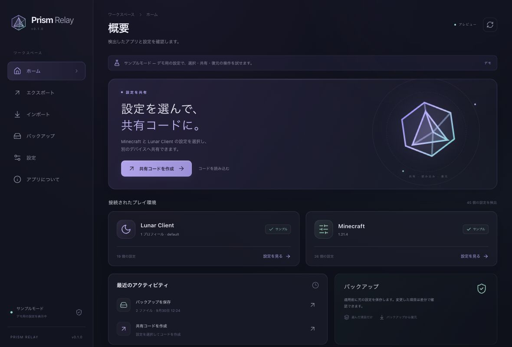

# Prism Relay

Minecraft と Lunar Client の設定を選んで、別の PC に持ち運ぶためのアプリです。操作設定だけ、HUD だけ、といった共有ができます。受け取った共有コードは、現在の設定との差分を確認してから適用できます。

[ダウンロード](https://github.com/Shake1227/PrismRelay/releases) · [共有コードの仕様](docs/share-format.md) · [Lunar 対応範囲](docs/lunar-schema.md)



## できること

- Minecraft / Lunar Client の設定フォルダを自動検出
- ツリーと検索で共有する項目を選択、選択内容をプリセットに保存
- 共有コードの作成、コピー、ファイル保存、QR コード表示
- QR 画像やカメラから共有コードを読み取り
- Import 時の項目選択と差分表示
- Lunarの確認済みMOD設定、文字色・背景色・押下時の色、虹色の動き、大きさを共有
- 色の差分を見本と不透明度で表示
- 最大化したウインドウのサイズに合わせてLunar HUDの位置を自動調整
- 適用前の自動バックアップ、手動保存、復元
- 左メニュー下部のボタンで通常表示・アイコン表示を滑らかに切り替え、状態を記憶して設定一覧を広く表示
- ダーク / ライト / OS 連動テーマ、アニメーションの軽減
- 日本語、英語、韓国語、中国語、フィンランド語、スペイン語、ドイツ語

Minecraft と Lunar Client のカードには、端末にあるアプリのアイコンを表示します。アイコンが見つからない場合や画像を読み込めない場合は、標準アイコンを使います。

## インストール

| OS | ダウンロードするファイル | 対応環境 |
| --- | --- | --- |
| Windows x64 | `.msi` または `-setup.exe` | Windows 10 / 11 |
| Windows ARM64 | `.msi` または `-setup.exe` | Windows 11 ARM64 |
| macOS Apple Silicon | `.dmg` | macOS 11 以降 |
| macOS Intel | `.dmg` | macOS 11 以降 |

Windows は PC の種類に合うインストーラーを実行してください。画面の案内に従ってインストールすると、スタートメニューから起動できます。WebView2 が必要な場合は、インストーラーが導入を案内します。

macOS は DMG を開き、Prism Relay を Applications フォルダへドラッグしてください。

Mac 版は Apple の公証を受けていないため、初回に「悪質なソフトウェアかどうかをAppleで確認できない」と表示されます。この GitHub の配布版を起動する場合は、次の手順で許可できます。

1. Applications の Prism Relay を開き、警告を閉じます。
2. **システム設定 → プライバシーとセキュリティ**を開き、下にスクロールします。
3. Prism Relay の **「このまま開く」** を押し、次の確認で **「開く」** を選びます。

詳しくは [Apple の案内](https://support.apple.com/ja-jp/102445#openanyway)を参照してください。署名を導入する際の設定は [docs/signing.md](docs/signing.md) にまとめています。

## 使い方

左メニューの切り替え時の動きは、OS またはアプリの「アニメーションの軽減」設定に従います。

### 設定を共有する

1. 「エクスポート」を開きます。LunarのHUDやMODを含める場合は、GUIプリセットを選びます。
2. 共有したい項目を選び、プレビューを確認します。
3. コードを作成し、コピー・ファイル・QR のいずれかで共有します。

共有コードは圧縮されています。Discord の通常メッセージに収まる長さなら、そのまま貼り付けて送れます。項目が多くコードが長い場合は、`.prism` ファイルを添付すると確実です。Resource Packs の共有対象はパック名の設定です。パック本体は別途用意してください。

### 共有コードを読み込む

1. 「インポート」でコードを貼り付けるか、`.prism` ファイルを開きます。QR 画像の選択とカメラスキャンも使えます。
2. 適用する項目を選びます。LunarのHUDやMODは、使用するGUIプリセットを選択してください。
3. 差分と対象ファイルを確認して適用します。変更前の設定は自動で保存されます。

ゲーム設定は既定のMinecraftフォルダを使用します。Minecraftの起動構成を選ぶ操作はありません。LunarのHUDやMODは、使用中のGUIプリセットを初期選択します。別のプリセットを選ぶこともできます。

同じMinecraftフォルダに `optionsLC.txt` がある場合は、`options.txt` とまとめて選択項目を更新します。Windowsの既定フォルダは `%APPDATA%/.minecraft`、Macは `~/Library/Application Support/minecraft` です。別のゲームフォルダを使用している場合は、環境設定でそのフォルダを指定してください。ゲームを終了してから適用し、完了後に起動してください。

カメラを使う場合は、OS のアクセス許可が必要です。画像とカメラ映像は端末内で処理されます。

適用が完了すると、光の粒子が結晶に集まり、発光して砕けるアニメーションを表示します。OSまたはアプリでアニメーションを軽減している場合は静止画になります。

設定はゲーム終了後の適用をおすすめします。起動中は警告が表示されます。適用先に存在しない項目や、値の形式が合わない項目は差分画面で確認できます。

### バックアップから戻す

「バックアップ」で日時と対象ファイルを確認し、復元するバックアップを選びます。復元前の状態も保存されるので、戻す操作を取り消す際にも使えます。

バックアップの保存先は OS のアプリデータフォルダ内の `io.github.shake1227.prismrelay/backups` です。元ファイル全体と元パスを含むため、端末内の個人データとして扱ってください。共有コードとは別に管理されます。

## 設定ファイルの扱い

共有対象は、形式を確認したファイルとキーに限定しています。共有コードに含まれるのは選択した設定値、バージョン情報、HUDの補正に使うサイズです。アカウント情報、認証トークン、サーバーアドレス、ログは対象外です。

選択した項目を更新します。Lunarの確認済み項目は、対象のMODやHUDが存在すれば省略された設定にも適用できます。Minecraft の未知の行や Lunar の未知の JSON フィールドは元のまま保持します。適用前にバックアップを取り、一時ファイルを検証してから置き換えます。処理が中断した場合は記録から復旧し、別のアプリによる変更を検出した場合はバックアップを保護します。

共有コードの SHA-256 は破損を検出するためのものです。送信者の本人確認や暗号化には使われません。カスタムリソースパック名にはファイル名が含まれるため、共有前にその項目を確認してください。

## プライバシー

設定の解析、コード生成、Import、バックアップ、QR 読み取りは端末内で完結します。更新確認を押すと GitHub API に接続します。GitHub・X・ライセンスのリンクはブラウザで開きます。

アカウント登録や共有用サーバーは不要です。診断ログには処理の種類と結果だけを記録します。

## 対応範囲

Lunar独自MODは、確認済みの有効・無効、表示オプション、キー設定、色や大きさを共有できます。検出したMODやHUDの確認済みの既定値は、共有元のファイルで省略されていても項目一覧に表示します。対象のMODやHUDが共有先にある場合は、省略された項目も適用できます。旧コードも読み込めます。旧形式の一部項目は、差分画面で適用対象外と表示される場合があります。Waypointの座標、マクロの内容、未検証の項目は対象外です。`optionsof.txt` は検出とバックアップに対応しています。

LunarのHUDを共有する際、サイズと設定を確認できる場合はコードに共有元のHUDサイズが含まれます。読み込み時は、Prism Relayを表示している画面で通常のゲームウインドウを最大化した場合のサイズを使い、HUDのX・Yを調整します。MinecraftのGUIサイズとMacのRetina表示も計算に含めます。補正後の値は差分画面で確認できます。

自動調整は、LunarでMinecraft 1.16.1以降を使う場合の確認済みバージョンと、座標の意味を確認できたHUDに対応しています。古いバージョンや必要な設定を取得できない場合は、自動調整をオフにして元の座標で読み込めます。HUD内部の子要素の位置は元のままです。サイズ情報がないコードでは、共有元で新しくコードを作成してください。元の座標を使う場合は「HUD位置をウインドウサイズに合わせる」をオフにできます。

ブラウザの `npm run dev` で表示されるのはサンプルデータです。デスクトップ版で実際の設定を操作できます。README の画像もサンプルデータを使っています。

## 開発

Node.js 22.22.2 以降の22系、または24.15 以降の24系（推奨）、Rust 1.90 以降、[Tauri の開発環境](https://v2.tauri.app/start/prerequisites/)を用意してください。

```sh
npm ci
npm run tauri dev
```

```sh
npm run typecheck
npm run lint
npm test
npm run build
cargo fmt --manifest-path src-tauri/Cargo.toml --check
cargo clippy --manifest-path src-tauri/Cargo.toml --all-targets --locked -- -D warnings
cargo test --manifest-path src-tauri/Cargo.toml --locked
```

UI は `src/`、設定の解析・共有コード・Import・バックアップは `src-tauri/src/` にあります。テストには合成データと一時フォルダを使っています。

## ビルドと公開

```sh
npm run tauri build
```

Windows では MSI とセットアップ EXE、macOS ではアプリと DMG を生成します。GitHub Actions でも4種類の環境でテストとビルドを実行します。

`v1.0.0` のようなタグを Push すると、インストーラー、対応するソース、`SHA256SUMS.txt` を GitHub Releases に公開します。依存ライブラリを更新した際は `python3 scripts/generate-notices.py` でライセンス通知を更新してください。

Windows のアプリアイコンは `src-tauri/icons/source-windows.svg` から生成します。SVG を編集した際は `node scripts/generate-windows-icon.mjs` を実行してください。

既存リリースの配布ファイルを更新する場合は、CI 完了後に「Update release」を手動実行し、その CI の run ID を指定します。Windows の4本と macOS の2本のインストーラー、対応する `prism-relay-v1.0.0-source.tar.gz`、チェックサムをまとめて更新します。ビルド元は `BUILD_INFO.json` で確認できます。

ビルド成果物、既知のゲーム設定・認証ファイル、バックアップ、証明書は `.gitignore` の対象です。リポジトリには開発用のソースと合成テストデータを置いています。

## 作者とライセンス

**Shake_1227** · [X: @shake_1227](https://x.com/shake_1227)

[GPL-3.0-or-later](LICENSE)。依存ライブラリのライセンスは [THIRD_PARTY_NOTICES.txt](THIRD_PARTY_NOTICES.txt) とアプリの「アプリについて」で確認できます。

Prism Relay は個人開発の非公式ツールです。Lunar Client、Minecraft、Microsoft、Mojang の製品名・商標は各権利者に帰属します。
